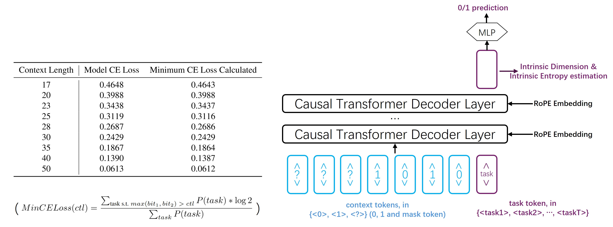
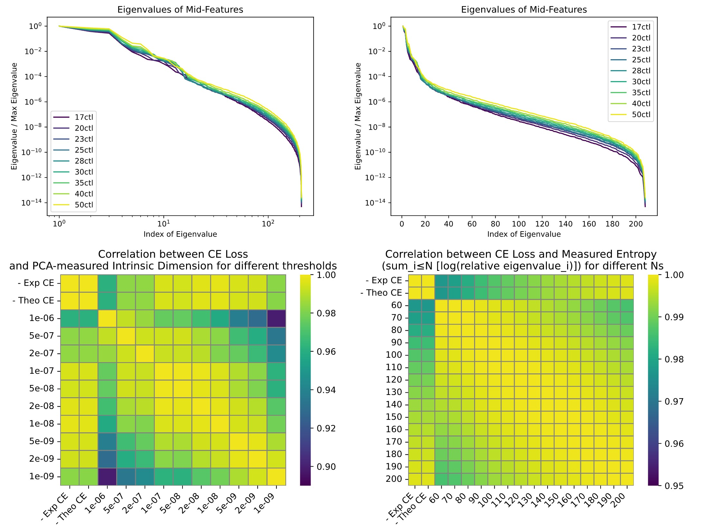
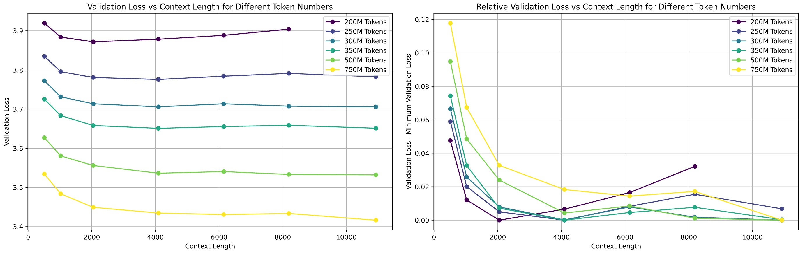
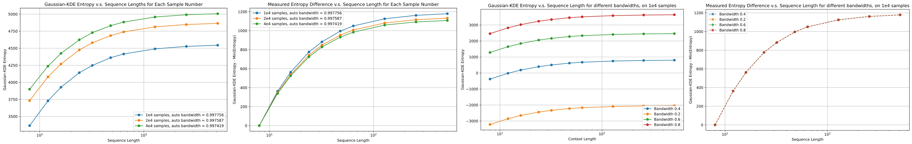
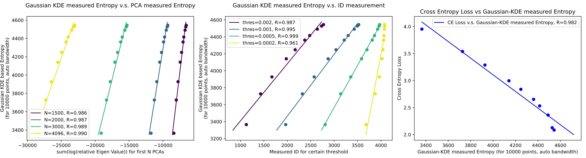

## Rebuttal Figures

**Rebuttal Figures** for ICML submission 1875.

(Due to a crash of anonymous git we created an anonymous account on github for rebuttals.)

====================

**Rebuttal Fig. 1**: **Left**: Minimum CE Loss calculated on synthetic dataset, and CE loss of the trained transformer-based model; the trained model approximates the Bayes Model well. For the synthetic dataset, in order to be more general, we increase task number to 200 and let them have different frequencies (other factors are same with synthetic dataset we used in submission); we let max context length be 60. **Right**: Attention-based model with RoPE; we use a 3-layer causal Transformer, with embedding dimension 208 and FFN dimension 832, RoPE embedding with base frequency 4000; input sequence length is always $60+1$, with 60 context tokens (either *0*, *1* or *?*) and 1 task tokens (chosen from task tokens of vocab size 200).

====================

**Rebuttal Fig. 2**: Results for transformer-based model with RoPE. **Upper figures**: PCA results for different context lengths (using and not using log for x axis, respectively). **Lower figures**: CE Loss v.s. Measured Intrinsic Dimension and CE Loss v.s. Measured Entropy, both showing good linear relationships.

====================

**Rebuttal Fig. 3**: More Results for OpenWebText; we use an equivalent batch size of ~0.1M tokens, and train the Language Models for certain token numbers, with 1000 linear warm-up iterations then using cosine decay to 1/10 of max-lr. We see that, given certain training token number, there is an optimal context length, which increases with the token number.

====================

**Rebuttal Fig. 4**: Gaussian-KDE based Entropy measurements. **Left two figures**: Measurements of Entropy (and Entropy difference) for different sample numbers. **Right two figures**: Measurements of Entropy (and Entropy difference) for different bandwidth settings.

====================

**Rebuttal Fig. 5**: Gaussian-KDE measured Entropy (10000 samples, auto bandwidth = 0.997756) v.s. PCA-measured Entropy (**left**), Measrued ID (**middle**) and Cross Entropy Loss (**right**).

====================